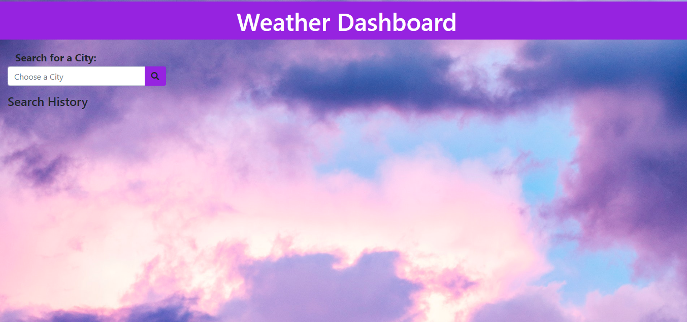
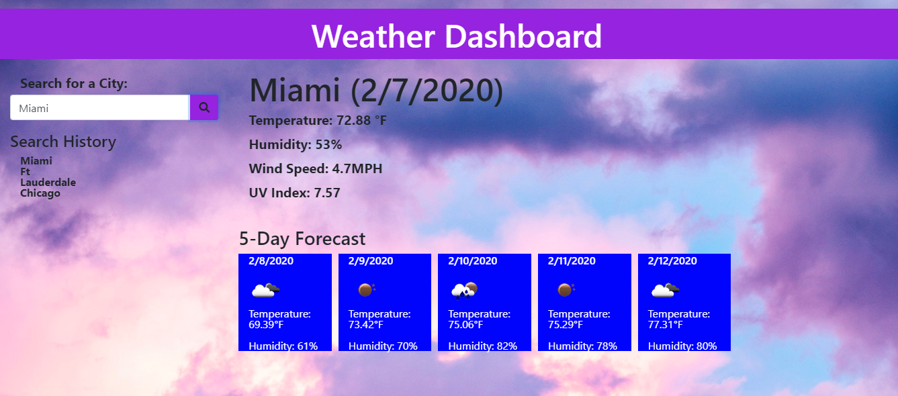
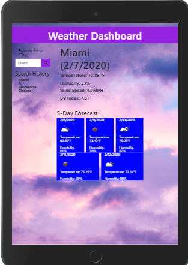

# KCWeatherApp
Weather condition search dashboard 

**Description:**

A weather application that allows the user search by city for current weather information for that day as well as the next five days.  App utilizes an (**API**)Application Programming Interface to pull data into the browser and features dynamically updated HTML and CSS powered by jQuery.  The following conditions were met:

1. https://OpenWeatherAPI.org used to retrieve weather data
2. Ajax calls used to hook into API to retrieve data in a JSON format
3. Initial Search displays the following for current day:

    * City                  
    * Humidity
    * Date                  
    * Wind Speed
    * Temp                  
    * UV Index  
    * Weather Icon Img
    
4. "Search" results will save in localStorage.
5. Search list will update dynamically when page resets.
6. 5-day Forecast logs consecutive days forecast below current day with the following    information displayed:    

    * Date                  
    * Temp                    
    * Weather Icon Img
    * Humidity

**Usage:**

Weather dashboards such as this are important to our daily lives.  They provide valuable information that allows us to plan appropriately for inclement weather.  Weather affects how and when we travel, what clothes we where, what activities we do in our free time.  Companies that deal with logistics rely on this information to appropriately plan business travel and adjust for impending delays.  Often, being ill-prepared can be very costly as shipments can be delayed, deliveries rerouted, etc. Being aware can give you an edge and in many cases save the day!

### File List:

1. Index.html
    
    Main Page - Day Planner

2. Script.js    
    
    Javascript for Main Page 

3. Style.css

    Stylesheet for all

4. Reset.css         

    Compressed set of CSS rules that resets the styling of all HTML elements to a consistent baseline.

### Link to site

https://karna1014.github.io/KCWeatherApp/.

### Opening Page - 

### Index Page - Full Screen/Laptop View

### Responsiveness - I-Pad (768px)

